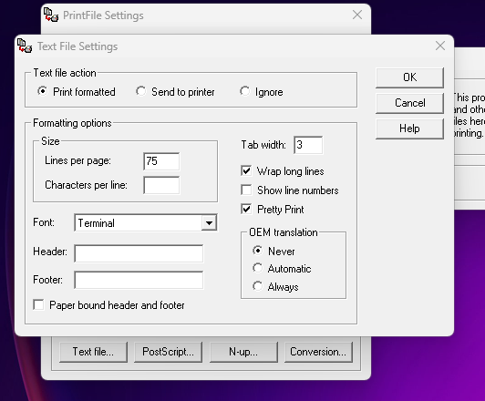

# Servidor de Impressora EPSON T20X

Este projeto estabelece um servidor local para a impressora EPSON T20X, permitindo a impressão via rede usando um cabo Serial/USB.

## 📌 Características

- Comunicação com a impressora EPSON T20X usando um cabo Serial/USB.
- Recebe dados para impressão via rede.
- Usa um servidor local para gerenciar e encaminhar os trabalhos de impressão.

## 🛠️ Pré-requisitos

1. Impressora EPSON T20X.
2. Cabo Serial/USB compatível.
3. PrintFile instalado e configurado.

## 🚀 Instalação e Configuração

### 1. Instalando o PrintFile

Para que este projeto funcione corretamente, é necessário instalar e configurar o PrintFile. Siga as instruções [deste link](https://www.lerup.com/printfile/) para uma configuração detalhada.

**Nota**: Assegure-se de que o PrintFile está configurado para se comunicar corretamente com a impressora EPSON T20X via cabo Serial/USB.
Caso seja necessário, altere o local do arquivo PrintFile para o diretório raiz do projeto e configure o arquivo ```config.json```.

### 2. Clonando e Iniciando o Servidor

```bash
git clone https://github.com/charleston10/epson-t20x-node-server
cd epson-t20x-node-server
npm install
npm start
```

O servidor agora deve estar rodando e escutando por trabalhos de impressão na porta especificada.

## 🖨️ Usando o Servidor de Impressão

Para enviar trabalhos de impressão para o servidor, faça uma requisição POST para a endpoint apropriada (por exemplo, `http://localhost:3000/print`) com os dados da impressão.

```curl --location 'localhost:3000/print' \
--header 'Content-Type: application/json' \
--header 'Cookie: mailpoet_page_view=%7B%22timestamp%22%3A1692872035%7D' \
--data '{
   "orderId": "988798",
   "dateTime": "01/01/2000 12h00",
   "deliveryAddress": "Rua Alameda dos Testes, 123",
   "total": "R$ 154,12",
   "clientName": "João John Jhony",
   "isPaid": false,
   "products": [{
       "quantity": 2,
       "name": "Estrela Vanilla",
       "price": "R$ 9,90",
       "total": "R$ 19,80"
   },
   {
       "quantity": 1,
       "name": "Coração de Cacau",
       "price": "R$ 12,90",
       "total": "R$ 12,90"
   }]
}' 
```

### PrintFile configuração da impressora EPSON T20X




## 🤝 Contribuição

Contribuições são bem-vindas! Sinta-se à vontade para abrir uma Issue ou Pull Request.


---

